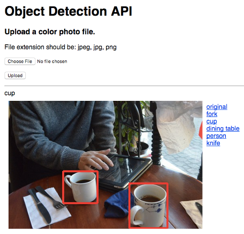

# TensorFlow Object Detection API demo

Disclaimer: This is not an official Google product.

This is an example application demonstrating how
 [TensorFlow Object Detection API][1] and [pretrained models][2]
 can be used to create a general object detection service.

## Products
- [TensorFlow][3]
- [Google Compute Engine][4]

## Language
- [Python][5]

[1]: https://github.com/tensorflow/models/tree/master/object_detection
[2]: https://github.com/tensorflow/models/blob/master/object_detection/g3doc/detection_model_zoo.md
[3]: https://www.tensorflow.org/
[4]: https://cloud.google.com/compute/
[5]: https://python.org

## Prerequisites
1. A Google Cloud Platform Account
2. [A new Google Cloud Platform Project][6] for this lab with billing enabled

[6]: https://console.developers.google.com/project

## Do this first
First you launch a GCE instance with the following configuration.

- vCPU x 8
- Memory 8GB
- Debian GNU/Linux 9 (stretch) as a guest OS
- Allow HTTP traffic
- Assign a static IP address

You can leave other settings as default. Once the instance has started,
 log in to the guest OS using SSH and change the OS user to root.

```
$ sudo -i
```

All remaining operations should be done from the root user.

## Install packages

```
# apt-get update
# apt-get install -y protobuf-compiler python-pil python-lxml python-pip python-dev git
# pip install Flask==0.12.2 WTForms==2.1 Flask_WTF==0.14.2 Werkzeug==0.12.2
# pip install --upgrade https://storage.googleapis.com/tensorflow/linux/cpu/tensorflow-1.1.0-cp27-none-linux_x86_64.whl
```

## Install the Object Detection API library

```
# cd /opt
# git clone https://github.com/tensorflow/models
# cd models/reseach
# protoc object_detection/protos/*.proto --python_out=.
```

## Download the pretrained model binaries

```
# mkdir -p /opt/graph_def
# cd /tmp
# for model in \
    ssd_mobilenet_v1_coco_11_06_2017 \
    ssd_inception_v2_coco_11_06_2017 \
    rfcn_resnet101_coco_11_06_2017 \
    faster_rcnn_resnet101_coco_11_06_2017 \
    faster_rcnn_inception_resnet_v2_atrous_coco_11_06_2017
  do \
    curl -OL http://download.tensorflow.org/models/object_detection/$model.tar.gz
    tar -xzf $model.tar.gz $model/frozen_inference_graph.pb
    cp -a $model /opt/graph_def/
  done
# ln -sf /opt/graph_def/faster_rcnn_resnet101_coco_11_06_2017/frozen_inference_graph.pb /opt/graph_def/frozen_inference_graph.pb
```

## Install the demo application

```
# cd $HOME
# git clone https://github.com/GoogleCloudPlatform/tensorflow-object-detection-example
# cp -a tensorflow-object-detection-example/object_detection_app /opt/
# cp /opt/object_detection_app/object-detection.service /etc/systemd/system/
```

This application provides a simple user authentication mechanism.
 You can change the username and password by modifying the following
 part in `/opt/object_detection_app/decorator.py`.

```
USERNAME = 'username'
PASSWORD = 'passw0rd'
```

## Launch the demo application

```
# systemctl daemon-reload
# systemctl enable object-detection
# systemctl start object-detection
# systemctl status object-detection
```

The last command outputs the application status, as in the
 following example:
```
● object-detection.service - Object Detection API Demo
   Loaded: loaded (/opt/object_detection_app/object-detection.service; linked)
   Active: active (running) since Mon 2017-06-19 07:31:48 UTC; 24s ago
 Main PID: 551 (app.py)
   CGroup: /system.slice/object-detection.service
           └─551 /usr/bin/python /opt/object_detection_app/app.py

Jun 19 07:31:48 object-detection-2 systemd[1]: Started Object Detection API Demo.
Jun 19 07:32:13 object-detection-2 app.py[551]: 2017-06-19 07:32:13.456353: W tensorflow/core/platform/cpu_f...ons.
Jun 19 07:32:13 object-detection-2 app.py[551]: 2017-06-19 07:32:13.456427: W tensorflow/core/platform/cpu_f...ons.
Jun 19 07:32:13 object-detection-2 app.py[551]: 2017-06-19 07:32:13.456438: W tensorflow/core/platform/cpu_f...ons.
Jun 19 07:32:13 object-detection-2 app.py[551]: 2017-06-19 07:32:13.456444: W tensorflow/core/platform/cpu_f...ons.
Jun 19 07:32:13 object-detection-2 app.py[551]: 2017-06-19 07:32:13.456449: W tensorflow/core/platform/cpu_f...ons.
Jun 19 07:32:13 object-detection-2 app.py[551]: * Running on http://0.0.0.0:80/ (Press CTRL+C to quit)
Hint: Some lines were ellipsized, use -l to show in full.
```

You have to wait around 60secs for the application to finish loading
 the pretrained model graph. You'll see the message 
 `Running on http://0.0.0.0:80/ (Press CTRL+C to quit)` when it's ready.

Now you can access the instance's static IP address using a web browser.
 When you upload an image file with a `jpeg`, `jpg`, or `png` extension,
 the application shows the result of the object detection inference.
 The inference may take up to 30 seconds, depending on the image.

The following example shows "cup" in the image. You can also check
 other objects such as fork, dining table, person and knife by clicking
 labels shown to the right of the image.

 

(Image from http://www.ashinari.com/en/)

## How to use different models
There are five pretrained models that can be used by the application.
 They have diffrent characteristics in terms of accuracy and speed.
 You can change the model used by the application with the following
 commands.

```
# systemctl stop object-detection
# ln -sf /opt/graph_def/[MODEL NAME]/frozen_inference_graph.pb /opt/graph_def/frozen_inference_graph.pb
# systemctl start object-detection
```

You specify one of the following models in `[MODEL NAME]`.

- ssd_mobilenet_v1_coco_11_06_2017
- ssd_inception_v2_coco_11_06_2017
- rfcn_resnet101_coco_11_06_2017
- faster_rcnn_resnet101_coco_11_06_2017
- faster_rcnn_inception_resnet_v2_atrous_coco_11_06_2017
